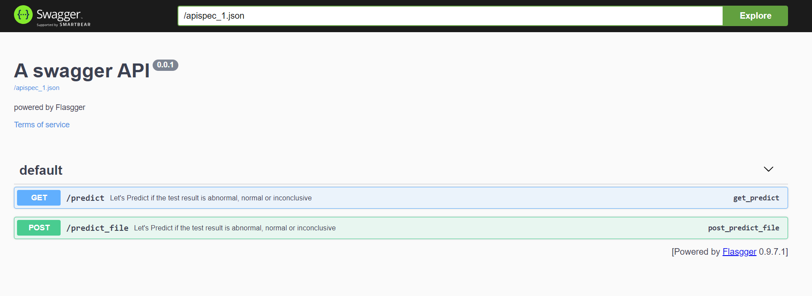
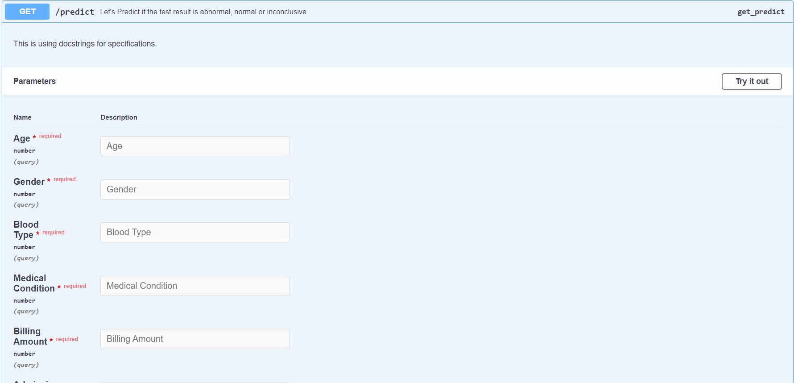
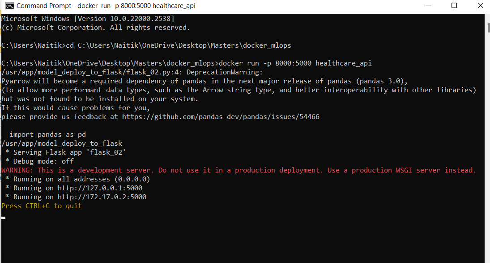

  <h3 align="center">Docker MLOps</h3>


<!-- TABLE OF CONTENTS -->
<details>
  <summary>Table of Contents</summary>
  <ol>
    <li>
      <a href="#about-the-project">About The Project</a>
      <ul>
        <li><a href="#built-with">Built With</a></li>
      </ul>
    </li>
    <li>
      <a href="#getting-started">Getting Started</a>
      <ul>
        <li><a href="#prerequisites">Prerequisites</a></li>
        <li><a href="#installation">Installation</a></li>
      </ul>
    </li>
    <li><a href="#usage">Usage</a></li>
    <li><a href="#roadmap">Roadmap</a></li>
    <li><a href="#contributing">Contributing</a></li>
    <li><a href="#license">License</a></li>
    <li><a href="#contact">Contact</a></li>
    <li><a href="#acknowledgments">Acknowledgments</a></li>
  </ol>
</details>


<!-- ABOUT THE PROJECT -->
## About The Project

This project is a complete MLOps pipeline encapsulated within a Docker container. It demonstrates the entire machine learning lifecycle, starting from data extraction, transformation, model training, and finally deploying the model for predictions using Flask. The entire process is containerized to ensure consistency and reproducibility across different environments.

<p align="right">(<a href="#readme-top">back to top</a>)</p>


### Built With

This section should list any major frameworks/libraries used to bootstrap your project. Leave any add-ons/plugins for the acknowledgements section. Here are a few examples.

* Amazon S3: For storing and retrieving the dataset.
* Pandas: For data manipulation and transformation.
* Scikit-learn: For training the machine learning model.
* Flask: For serving the trained model and making predictions.
* Docker: For containerizing the entire pipeline to ensure a consistent environment.
* Boto3: For interacting with Amazon S3 from Python scripts.


<p align="right">(<a href="#readme-top">back to top</a>)</p>

## Demo








<!-- GETTING STARTED -->
## Getting Started

This is an example of how you may give instructions on setting up your project locally.
To get a local copy up and running follow these simple example steps.

### Prerequisites

* Docker: Make sure Docker is installed on your machine. You can download it from [Docker Desktop](https://www.docker.com/products/docker-desktop/).
* Python 3.10+: The project uses Python for data processing and model training.
* AWS Account and Console: To interact with Amazon S3, you need to create an account with AWS. Do it from [here](https://signin.aws.amazon.com/signup?request_type=register).
* Amazon S3 Bucket: Create a bucket in S3. (All the objects(datasets, files) are stored in buckets in S3). To learn how to create an AWS Bucket, follow this [link](https://docs.aws.amazon.com/AmazonS3/latest/userguide/creating-bucket.html).

<!--* npm
  ```sh
  npm install npm@latest -g
  ``` -->

<!--### Installation

_Below is an example of how you can instruct your audience on installing and setting up your app. This template doesn't rely on any external dependencies or services._

1. Get a free API Key at [https://example.com](https://example.com)
2. Clone the repo
   ```sh
   git clone https://github.com/your_username_/Project-Name.git
   ```
3. Install NPM packages
   ```sh
   npm install
   ```
4. Enter your API in `config.js`
   ```js
   const API_KEY = 'ENTER YOUR API';
   ```
-->
<p align="right">(<a href="#readme-top">back to top</a>)</p>


<!-- USAGE EXAMPLES -->
## Usage
Pull the repository and to use this project, follow these steps:
1. Install the dependencies:
   * Install python dependencies required for the project.
   ```sh
   pip install -r requirements.txt
   ```
1. Extract Data from S3:
   * Navigate to the extract_data_from_s3 folder.
   * Run the extract_data_s3.py script to download the dataset files from your S3 bucket. Ensure that the dataset files are downloaded into the same folder.

2. Train the model:
   * Navigate to the model_training folder.
   * Run the model_training.py script to preprocess the data, train the model using a RandomForest classifier, create a pickle file of the trained model, and perform evaluation.

3. Deploy Model with Flask:
   * Navigate to the model_deploy_to_flask folder.
   * Run the flask_02.py script. This will start a Flask server and provide a UI using Swagger to perform predictions with the trained model's pickle file.

4. Run the file with respect to the host and port mentioned in app.run().
   ```sh
   app.run(host='0.0.0.0',port=5000)
   ``` 

<p align="right">(<a href="#readme-top">back to top</a>)</p>


<!-- ROADMAP -->
## Docker

The entire MLOps pipeline is containerized using Docker to ensure a consistent environment. Follow the instructions below to build and run the Docker container.

### Initialize the Dockerfile
In the repository, you will find a Dockerfile that describes the steps to create the Docker image. Here’s a breakdown of the commands used in the Dockerfile:
1. FROM
   * The FROM command sets the base image for subsequent instructions. In this case, we are using an official Python image.
   ```sh
   FROM python:3.12.4-slim
   ```
2. COPY
   * The COPY command copies files or directories from the host file system into the Docker image.
   ```sh
   COPY . /usr/app/
   ```
3. EXPOSE
   * The EXPOSE command informs Docker that the container listens on the specified network ports at runtime.
   ```sh
   EXPOSE 5000
   ```
4. WORKDIR
   * The WORKDIR command sets the working directory inside the Docker image. All subsequent commands are run from this directory.
   ```sh
   WORKDIR /usr/app/
   ```
5. RUN
   * The RUN command executes any commands in a new layer on top of the current image and commits the results.
   ```sh
   RUN pip install -r requirements.txt
   ```
6. CMD
   * The CMD command provides defaults for an executing container. It sets the command to run when the container starts.
   ```sh
   CMD python model_deploy_to_flask/flask_02.py
   ```
<p align="right">(<a href="#readme-top">back to top</a>)</p>

### Building and Running the Docker Container
1. Build the Docker Image
   * Navigate to the root directory of the project where the Dockerfile is located.
   ```sh
   docker build -t mlops-container .
   ```
2. Run the Docker Container
   * Run the container using the image built in the previous step.
   ```sh
   docker run -p 8000:5000 mlops-container
   ```


<!-- LICENSE -->
## License

Distributed under the MIT License. See `LICENSE.txt` for more information.

<p align="right">(<a href="#readme-top">back to top</a>)</p>


<!-- CONTACT -->
## Contact

Project Link: [https://github.com/your_username/repo_name](https://github.com/your_username/repo_name)

<p align="right">(<a href="#readme-top">back to top</a>)</p>


